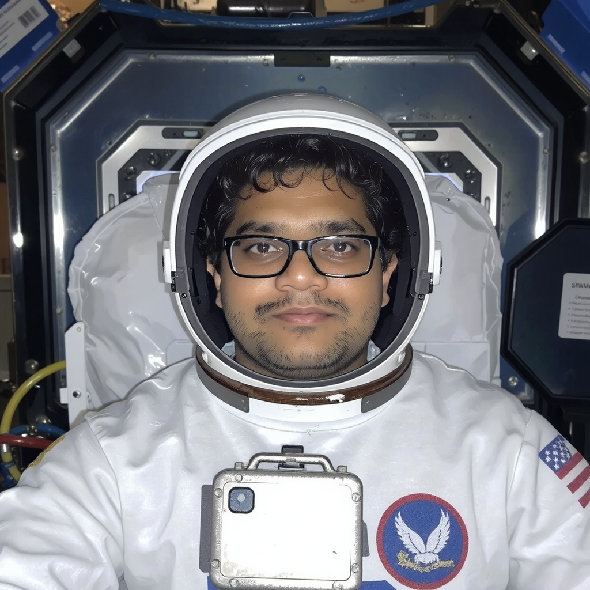
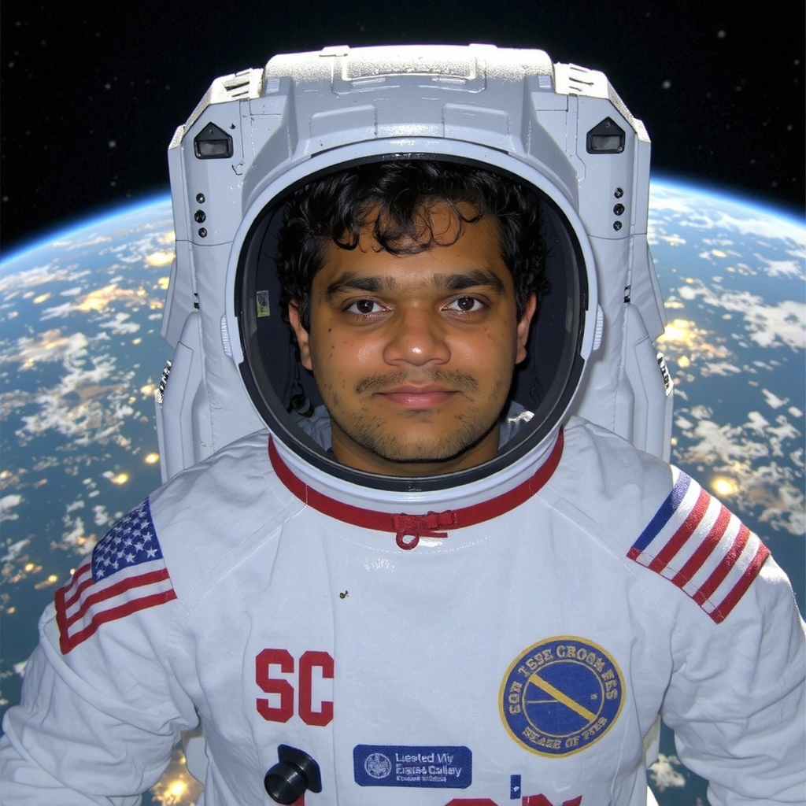

# Flux-Schnell Diffusion Transformer Model Fine Tuning Across Hardware Configurations

## Introduction to Diffusion Transformers

Diffusion Transformers (DTs) are a novel type of models that combines ideas from diffusion models (often used in generative tasks like image generation) with transformers (widely used for sequence modeling and language tasks). They leverage the strengths of both approaches for various generative and modeling tasks.

### How do they work?
- **Diffusion Process:** The model gradually adds noise to the data (e.g., image or text) in multiple timesteps and learns to reverse this noising process to generate clean data from random noise.
  
- **Transformer Architecture:** A transformer-based model captures long-range dependencies in the data using self-attention, enhancing the generation process by modeling complex relationships.

- **Iterative Denoising:** The model performs a series of denoising steps, progressively refining the data from noisy to clean through a learned reverse diffusion process.

- **Conditional Generation:** Diffusion Transformers can generate data conditioned on other inputs (e.g., text-to-image generation), allowing for flexible and context-aware outputs.

 

These models have demonstrated significant success in applications such as image generation, text-to-image synthesis, video generation, anomaly detection, and more.

  
   
  <i>Diffusion Transformer Architecture</i>

 

## :star: Project Importance

Tuning a flux-schnell diffusion transformer model across various hardware configurations is crucial because:

- It helps understand how the model performance scales with computational resources.
- It enables optimizing training for different hardware setups, leading to more efficient use of resources.
- It provides insights into the trade-offs between training time, model quality, and hardware costs, helping to identify the best configuration for different scenarios.

This experimentation allows us to make informed decisions about deploying and scaling diffusion models effectively.

 

## :technologist: Experimental Approach

In this project, we will tune our flux-schnell model on three hardware configurations to assess performance:

1. **CPU on a laptop**: A baseline, commonly accessible configuration.
2. **Single GPU on a remote cluster**: A more powerful setup for comparison.
3. **Multiple GPUs on a single node**: A high-performance configuration aimed at faster processing and larger scale.

For each configuration, we'll:

- Train the model, closely monitoring performance metrics.
- Evaluate the generated outputs and assess training efficiency.
- Compare results across configurations to understand the strengths and weaknesses of each setup.

 

## :memo: Performance Evaluation

## Dataset

| | | |
|:-------------------------:|:-------------------------:|:-------------------------:|
|  [trigger] in a white hoodie and grey pants, in a park |   [trigger] in a black hoodie and blue shorts, on a pier at night| [trigger] in a grey t-shirt and black shorts, in the ocean, wearing sunglasses|
| [trigger] in a pink hoodie and black shorts, standing in front of a waterfall |   [trigger] in a white t-shirt, selfie, in a garden, wearing glasses ||
||

### Inference Output

| | | |
|:-------------------------:|:-------------------------:|:-------------------------:|
| <b>Prompt:</b>  a woman holding a coffee cup, in a beanie, sitting at a cafe |   <b>Prompt:</b> Pranav is an astronaut, in space (1) | <b>Prompt:</b> Pranav is an astronaut, in space (2)|
| <b>Prompt:</b>  Pranav is an astronaut, in space (3) |   <b>Prompt:</b> Pranav is an astronaut, in space (4) |  <b>Prompt:</b> Pranav is an astronaut, in Ocean (1)|
| <b>Prompt:</b> Pranav is an astronaut, in Ocean (2) |

We evaluate performance based on two key sets of metrics: **Quality** and **Efficiency**.

### Quality Metrics (Keeping tuning time constant)

#### 1. Peak Signal-to-Noise Ratio (PSNR)

PSNR is a measure of the quality of generated images by comparing the noise in the image to the signal. Higher PSNR values indicate better quality images. PSNR helps quantify the clarity and accuracy of the generated data.

#### 2. Structural Similarity Index (SSIM)

SSIM measures the perceptual similarity between two images, considering structural information, luminance, and texture contrast. Unlike PSNR, SSIM evaluates how similar the visual structure is, making it a more reliable indicator of image quality. Higher SSIM values signify images that are more similar to the real data.

These metrics help quantify the visual fidelity of generated images compared to real images.

 

### Efficiency Metrics (Keeping the number of tuning iterations constant)

#### 1. Training Speed

Measured in iterations per second, this metric assesses the model's efficiency during the training phase. Higher training speed indicates that the model can learn faster, potentially leading to shorter training times and more efficient resource usage.

#### 2. Inference Speed

Evaluated in steps per second using a batch size of 256 in FP32 (32-bit floating point precision), this metric is crucial for understanding the model's efficiency during deployment. Higher inference speeds enable quicker output generation, making the model more suitable for real-time applications.

 

## :pencil2: Conclusion

In this project, we'll analyze the performance of the flux-schnell diffusion transformer model across different hardware configurations using both quality and efficiency metrics. By optimizing training time and ensuring efficient resource usage, we aim to balance model performance and computational cost, ultimately providing valuable insights for deploying diffusion models at scale.

  

# Group Members

- Aniket Ladukar
- Pranav Parnerkar
- Shriya Upasani
- Punith Krishna Pothula

 

#### Fall 2024 - CSCI 596 - Scientific Computing and Visualization - University of Southern California - Thomas Lord Department of Computer Science - Viterbi School of Engineering
