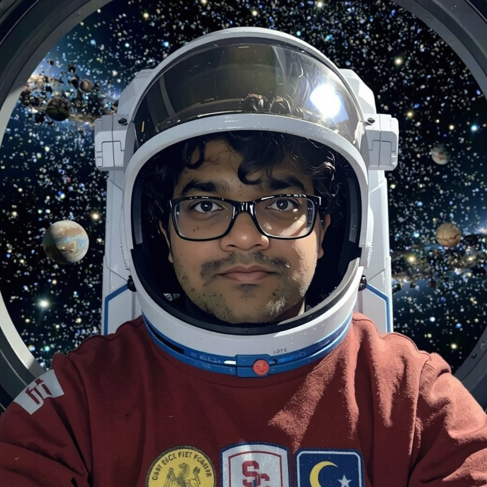

# Flux-Schnell Diffusion Transformer Model Fine Tuning Across Hardware Configurations

## 🚀 Introduction to Diffusion Transformers

Diffusion Transformers (DTs) are a novel type of models that combines ideas from diffusion models (often used in generative tasks like image generation) with transformers (widely used for sequence modeling and language tasks). They leverage the strengths of both approaches for various generative and modeling tasks.

### How do they work?
- **Diffusion Process:** The model gradually adds noise to the data (e.g., image or text) in multiple timesteps and learns to reverse this noising process to generate clean data from random noise.
  
- **Transformer Architecture:** A transformer-based model captures long-range dependencies in the data using self-attention, enhancing the generation process by modeling complex relationships.

- **Iterative Denoising:** The model performs a series of denoising steps, progressively refining the data from noisy to clean through a learned reverse diffusion process.

- **Conditional Generation:** Diffusion Transformers can generate data conditioned on other inputs (e.g., text-to-image generation), allowing for flexible and context-aware outputs.

 

These models have demonstrated significant success in applications such as image generation, text-to-image synthesis, video generation, anomaly detection, and more.

  
   
  <i>Diffusion Transformer Architecture</i>

 

## :star: Project Importance

Tuning a flux-schnell diffusion transformer model across various hardware configurations is crucial because:

- It helps understand how the model performance scales with computational resources.
- It enables optimizing training for different hardware setups, leading to more efficient use of resources.
- It provides insights into the trade-offs between training time, model quality, and hardware costs, helping to identify the best configuration for different scenarios.

This experimentation allows us to make informed decisions about deploying and scaling diffusion models effectively.

 

## :technologist: Experimental Approach

In this project, we will tune our flux-schnell model on two hardware configurations to assess performance:

1. **Nvidia A40 GPU on CARC**: 8 CPU Cores, 64GB RAM, 40GB VRAM
2. **Nvidia A100 GPU on CARC**: 8 CPU Cores, 64GB RAM, 80GB VRAM

For each configuration, we'll:

- Fine tune the model, closely monitoring loss and time taken.
  - Fine tuning iterations: 500 and 2000.
- Evaluate the generated outputs and assess training efficiency.
- Compare results across configurations to understand the strengths and weaknesses of each setup.

 

## :memo: Performance Evaluation

## Dataset

The custom dataset we used contained five images of one of the team members with accompanying text files with the following captions describing the subject and the image:
- [trigger] in a white hoodie and grey pants, in a park
- [trigger] in a black hoodie and blue shorts, on a pier at night
- [trigger] in a grey t-shirt and black shorts, in the ocean, wearing sunglasses
- [trigger] in a pink hoodie and black shorts, standing in front of a waterfall
- [trigger] in a white t-shirt, selfie, in a garden, wearing glasses

Here, `[trigger]` is the action word we use to associate the subject in the images.

### Inference Output

| | | | |
|:-------------------------:|:-------------------------:|:-------------------------:|:-------------------------:|
| <b>Prompt:</b> Pranav is an astronaut, in space (1)    <b> Hardware Configuration:</b>   GPU: A40   CPU: 64GB RAM   Training Iterations : 500| <b>Prompt:</b> Pranav is an astronaut, in space (2)    <b> Hardware Configuration:</b>   GPU: A100   CPU: 64GB RAM   Training Iterations : 500 | <b>Prompt:</b>  Pranav is an astronaut, in space (3)    <b> Hardware Configuration:</b>   GPU: A40   CPU: 64GB RAM   Training Iterations : 2000|  <b>Prompt:</b> Pranav is an astronaut, in space (4)    <b> Hardware Configuration:</b>   GPU: A100   CPU: 64GB RAM   Training Iterations : 2000|

 

### Metrics (Keeping the number of tuning iterations constant)

#### 1. Speedup

Ratio of fine tuning time taken by the slower GPU to the faster GPU

| | |
|:-------------------------:|:-------------------------:|
| 500 Steps| 2000 Steps|

<em>Observation</em>: Average Speedup of 1.8x was observed when we used the A100
 
<em>Analysis</em>: A100 offers a higher tensor core count (336 for A40 and 432 for A100), a significantly faster memmory bus (384 bit for A40 and 5120 bit for A100) and VRAM bandwidth (696GB GB/s for A40 and 1555 GB/s for A100). These factors attribute to its speedup and performance for fine tuning a large diffusion transformer.

 

#### 2. Inference Speed

Time taken by a tuned model to yield an image given a prompt. We observed inference time double across the two hardware configurations (34s for A40 and 17s for A100)

 

#### 3. Loss Vs Training Iterations

- ##### 500 Steps

- ##### 2000 Steps

<em>Observation</em>: Similar losses are observed in both cases 
 
<em>Analysis</em>: Sample images generated during training and inference visually look very similar as shown in our image grid so we were expecting similar loss plots for both hardware configurations

 

### Performance Across Different GPUs

**NVIDIA A100:** The A100 demonstrates consistent scaling, with the time per step remaining proportional across both step configurations. This indicates that the A100 handles the workload efficiently, maintaining a predictable scaling ratio. The A100 provides better throughput and efficiency, making it a preferred choice for larger-scale training tasks.
**NVIDIA A40:**  For 2000 steps, the runtime on the A40 is significantly longer than on the A100, suggesting that the A100 is more optimized for high-performance computations. 

### Training Speed Calculations

| GPU | Steps | Runtime(s) | Training Speed (steps/s) |
| ------------- | ------------- | ------------- | ------------- |
| NVIDIA A100  | 500  | 1013 | 0.4936 |
| NVIDIA A100  | 2000  | 5236 | 0.3820 |
| NVIDIA A40  | 500  | 1744 | 0.2866 |
| NVIDIA A40  | 2000  | 9017 | 0.2218 |

- For the same task and configuration, the NVIDIA A100 is more efficient in terms of training speed, making it preferable when faster training is a priority.  
- Training becomes less efficient as the number of steps increases. This may indicate bottlenecks in resource utilization (e.g., memory bandwidth, communication overhead).  
- The A100's scalability and efficiency at larger workloads make it more suitable for tasks requiring longer training durations or larger datasets. 
- **If cost is a factor:**  
NVIDIA A40 may be more cost-effective for shorter training runs where absolute speed is less critical, as its performance is lower but still sufficient.  
For large-scale tasks where time-to-completion is crucial, the higher training speed of the A100 may justify its potentially higher cost. 

 

## :pencil2: Conclusion

In this project, we analyzed the performance of the flux-schnell diffusion transformer model across different hardware configurations using relevant metrics. By optimizing training time and ensuring efficient resource usage, we studied model performance and computational cost, ultimately gaining valuable insights for deploying diffusion models and broadly generative models at scale.

  

# Group Members

- Aniket Ladukar
- Pranav Parnerkar
- Shriya Upasani
- Punith Krishna Pothula

 

#### Fall 2024 - CSCI 596 - Scientific Computing and Visualization - University of Southern California - Thomas Lord Department of Computer Science - Viterbi School of Engineering
